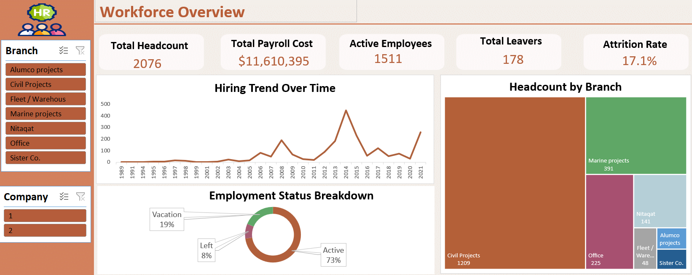
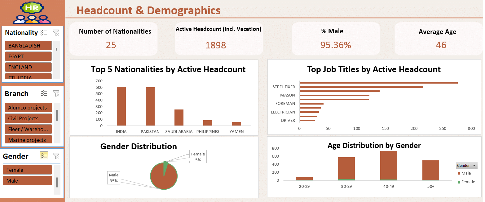
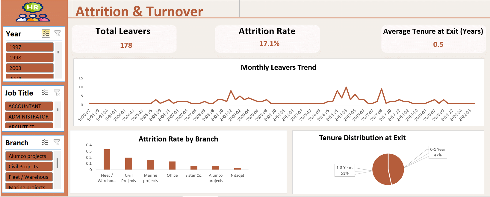
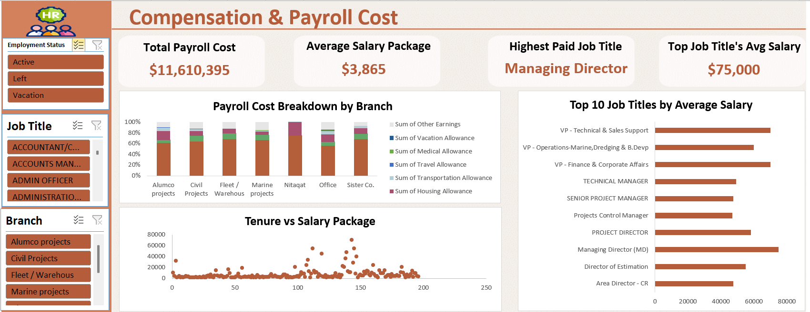
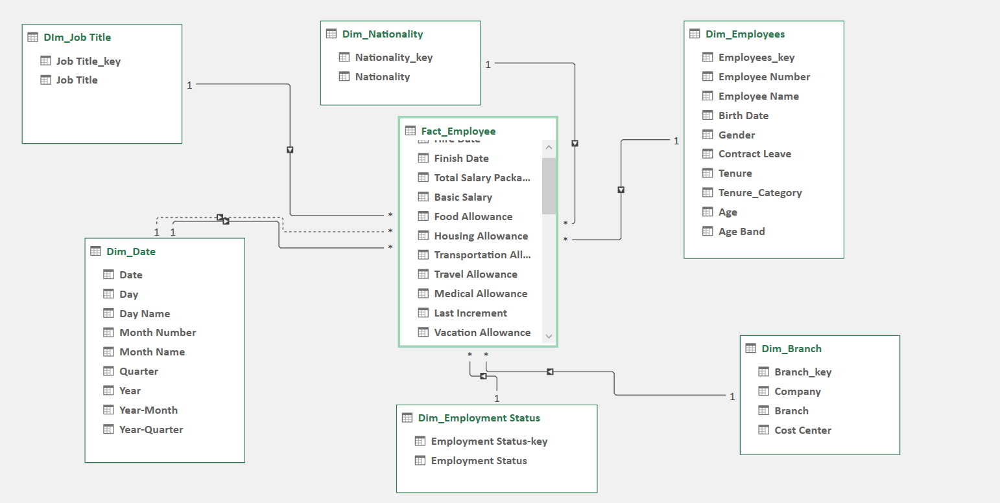

# HR Analytics Dashboard (Excel)

An end-to-end HR analytics solution built entirely in **Excel**, using **Power Query, Power Pivot, and DAX** on top of a **Star Schema** data model. The dashboard covers workforce composition, demographics, attrition, and compensation across a 2,000+ employee dataset.

---

## ❓ Business Questions

Each page was designed around a specific set of business questions rather than being built chart-first:

**Workforce Overview**
- How many employees do we currently have, and what does the overall cost picture look like?
- What is the current attrition rate, and how has hiring trended over time?
- How is headcount distributed across branches?

**Headcount & Demographics**
- What does the workforce look like in terms of gender, age, and nationality?
- Which job titles have the largest headcount?

**Attrition & Turnover**
- What is the monthly/overall attrition rate, and is it trending up or down?
- Which branches or job titles have the highest attrition?
- How long do employees typically stay before leaving — and is there an early-tenure risk?

**Compensation & Payroll Cost**
- How does total payroll cost break down by branch and by salary component (basic pay vs. allowances)?
- Which job titles are the highest paid?
- Does salary scale with tenure, or are they largely independent?

---

## 📊 Dashboard Pages

### 1. Workforce Overview
High-level KPIs and trends for executive reporting.
- **KPIs:** Total Headcount, Total Payroll Cost, Active Employees, Total Leavers, Attrition Rate
- **Charts:** Hiring Trend Over Time (Line), Employment Status Breakdown (Donut), Headcount by Branch (Treemap)



### 2. Headcount & Demographics
Understanding who makes up the workforce.
- **KPIs:** Number of Nationalities, Active Headcount (incl. Vacation), % Male, Average Age
- **Charts:** Top 5 Nationalities by Active Headcount, Top Job Titles by Active Headcount, Gender Distribution (Pie), Age Distribution by Gender (Stacked Column)



### 3. Attrition & Turnover
Identifying who is leaving, and when.
- **KPIs:** Total Leavers, Attrition Rate, Average Tenure at Exit
- **Charts:** Monthly Leavers Trend (Line), Attrition Rate by Branch (Bar), Tenure Distribution at Exit (Pie)
- **Key Insight:** 100% of leavers exited within their first 3 years, with 47% leaving inside the first year — pointing to early-tenure retention issues rather than long-term burnout.



### 4. Compensation & Payroll Cost
Analyzing salary structure and cost distribution.
- **KPIs:** Total Payroll Cost, Average Salary Package, Highest Paid Job Title, Top Job Title's Avg Salary
- **Charts:** Payroll Cost Breakdown by Branch (Stacked Bar), Top 10 Job Titles by Average Salary (Bar), Tenure vs Salary Package (Scatter)



---

## 🗂️ Data Model

The data model follows a classic **Star Schema** — a single fact table connected to six dimension tables, built and managed entirely in Power Pivot.



**Fact Table**
- `Fact_Employee` — grain: one row per employee, with hire/finish dates, salary components, and cost measures

**Dimension Tables**
- `Dim_Employees` — demographic attributes (gender, birth date, tenure)
- `Dim_Branch` — branch, company, cost center
- `Dim_Job_Title`
- `Dim_Nationality`
- `Dim_Employment_Status`
- `Dim_Date` — role-playing dimension used for both Hire Date and Finish Date via `USERELATIONSHIP`

## 🧮 Key DAX Measures

| Measure | Purpose |
|---|---|
| `Attrition Rate` | Leavers ÷ Average Headcount |
| `Monthly Attrition Rate` | Time-series attrition using `USERELATIONSHIP` on Finish Date |
| `Average Tenure at Exit` | `DATEDIFF` between Hire Date and Finish Date, computed only for leavers |
| `Cost per Employee` | Total Payroll Cost ÷ Active Employees |
| `Tenure at Exit Category` | Calculated column bucketing exits into 0-1 / 1-3 / 3-5 / 5+ years |

## 🛠️ Tools & Techniques

- Power Query (data cleaning,custom columns)
- Power Pivot Data Model (fact relationships, role-playing dimensions)
- DAX (measures, calculated columns, `USERELATIONSHIP`, `SUMMARIZE`/`TOPN`)
- PivotTables & PivotCharts driven entirely by the Data Model
- Synchronized slicers across all report pages

## 📁 Repository Contents

```
├── README.md
├── workforce_overview.png
├── headcount_demographics.png
├── attrition_turnover.png
├── compensation_payroll.png
└── data_model.png
```

